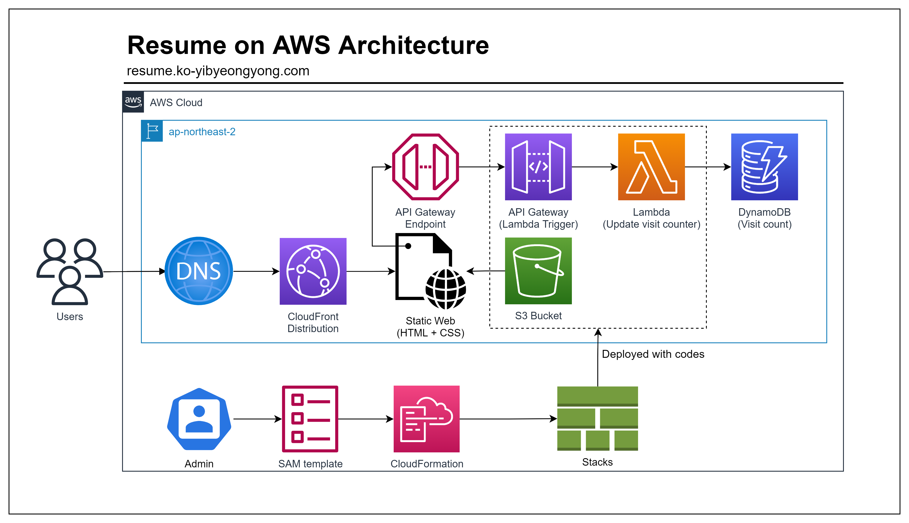

# Resume on AWS
AWS의 주요 서비스들을 활용하여 배포한 정적 웹 페이지 기반 이력서

[Forrest Brazeal](https://forrestbrazeal.com/)의 [Cloud Resume Challenge](https://cloudresumechallenge.dev/docs/the-challenge/)의 도전 과제들을 수행했습니다.

## List of Challenges

도전 과제를 진행하며 만든 기능, 경험한 기술 목록과 간략한 설명입니다.

| Features | Description | Used Techs |
|:---:|---|---|
| HTTPS | 사용자, 엔드포인트 간의 안전한 연결 구성 | AWS CloudFront, AWS Certificate Manager |
| View Count | 이력서에 들어갈 방문자 수 카운트 기능 구현 | Javascript, AWS API Gateway, AWS Lambda, AWS DynamoDB |
| IaC | AWS 리소스를 코드를 통해 API로 배포 | AWS CloudFormation, AWS SAM |
| CI/CD | Github에 갱신된 변경사항이 자동으로 배포되도록 구성 | Github Actions |

## Proejct Architecture

## Docs

프로젝트 진행 과정을 [문서화](https://dev-wiki.yibyeongyong.com/projects/cloud-resume-challenge)하고있습니다.

## Demo

[이력서 링크](https://resume-ko.yibyeongyong.com)

## Credits

 * [Forrest Brazeal](https://forrestbrazeal.com/)
 * [mikepqr](https://github.com/mikepqr)
