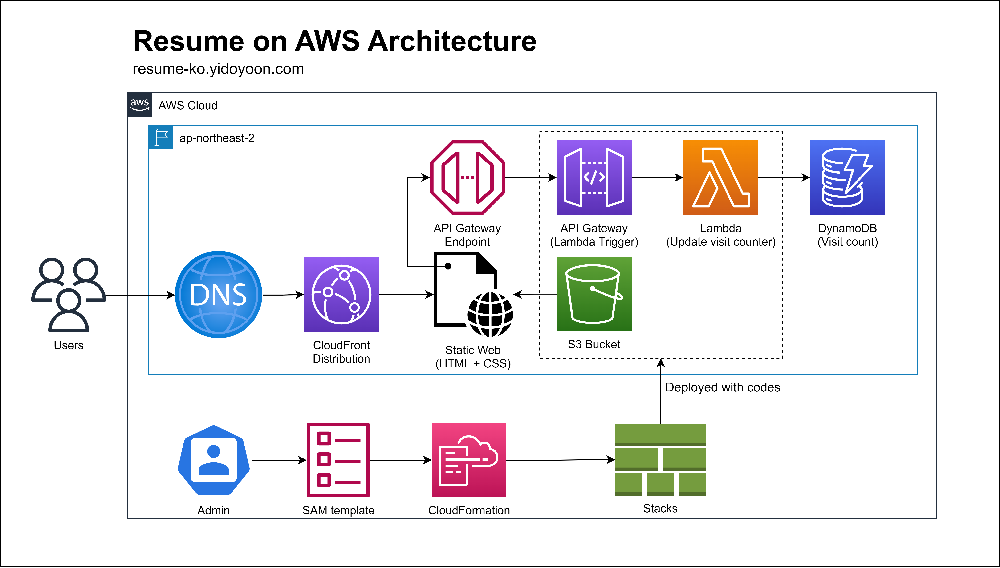

# Resume on AWS
AWS의 주요 서비스들을 활용하여 배포한 정적 웹 페이지 기반 이력서

[Forrest Brazeal](https://forrestbrazeal.com/)의 [Cloud Resume Challenge](https://cloudresumechallenge.dev/docs/the-challenge/)의 도전과제들을 수행했습니다.

## List of Challenges

각 챌린지 항목의 간략한 설명입니다.

| **Description**                                         | **Progress** |                                    **Details**                                    |
|---------------------------------------------------------|:------------:|:---------------------------------------------------------------------------------:|
| AWS, GCP, Azure 관련 자격증 취득                               |      예정      | [link](https://dev-wiki.yibyeongyong.com/cloud-resume-challenge/00.certification) |
| HTML, CSS를 활용하여 이력서 작성                                  |      완료      |    [link](https://dev-wiki.yibyeongyong.com/cloud-resume-challenge/01.resume)     |
| S3 Bucket을 활용하여 이력 배포                                   |      완료      |                                                                                   |
| CloudFront를 활용하여 안전한 연결 구성                              |      완료      |                                                                                   |
| Route53을 활용하여 도메인 부여                                    |      완료      |                                                                                   |
| Javascript를 활용하여 이력서에 방문자 수 카운트 구현                      |     진행중      |                                                                                   |
| DynamoDB Table을 활용하여 방문자 수 저장                           |      완료      |                                                                                   |
| Lambda, API Gateway를 활용하여 DynamoDB와 상호작용 할 API 생성       |      완료      |                                                                                   |
| Lambda 작성 시, Python을 활용하여 작성                            |      완료      |                                                                                   |
| Lambda 검증할 테스트 코드 작성                                    |      완료      |                                                                                   |
| DynamoDB Table, API Gateway, Lambda를 SAM을 활용하여 배포       |     진행중      |                                                                                   |
| Github 레포지토리에 코드 공개하기                                   |      완료      |                                                                                   |
| Github Actions를 통해 수정된 코드가 자동으로 테스트를 진행하고 AWS에 배포되도록 구현 |     진행중      |                                                                                   |
| Github Actions를 통해 수정된 이력서가 자동으로 S3 Bucket에 업로드 되도록 구현  |      완료      |                                                                                   |
| 프로젝트 진행 과정 블로그로 공개하기                                    |     진행중      |                                                                                   |

## Proejct Architecture

## Demo

[이력서 링크](https://resume-ko.yibyeongyong.com)

## Credits

 * [Forrest Brazeal](https://forrestbrazeal.com/) - 챌린지 제안
 * [mikepqr](https://github.com/mikepqr) - 이력서 템플릿
